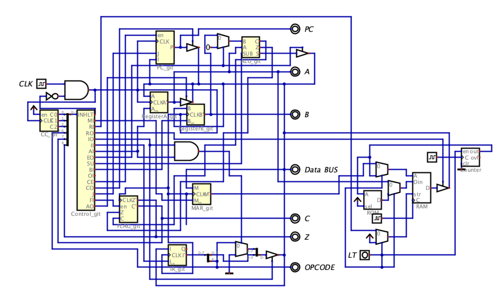
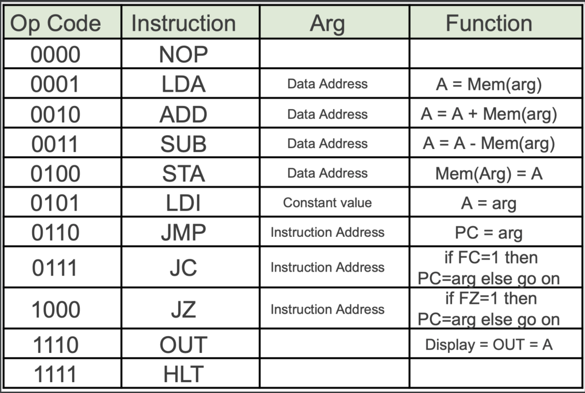
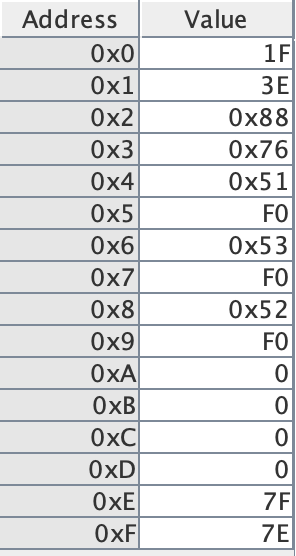
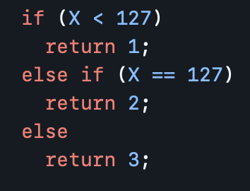
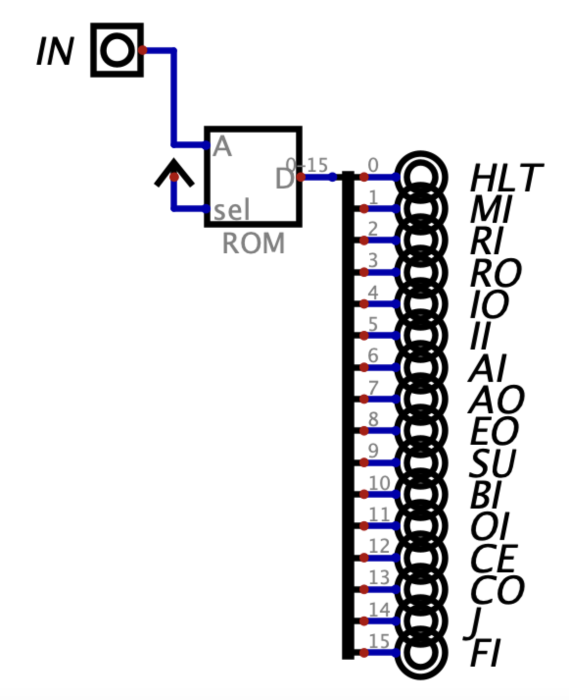
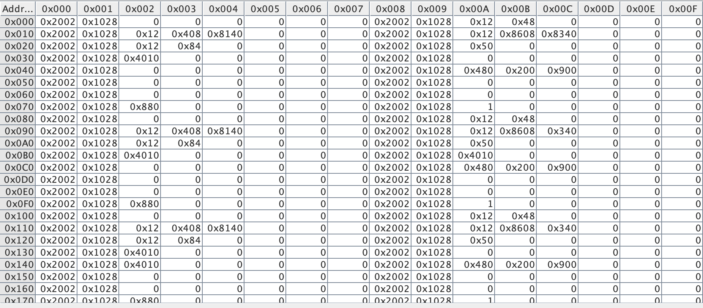
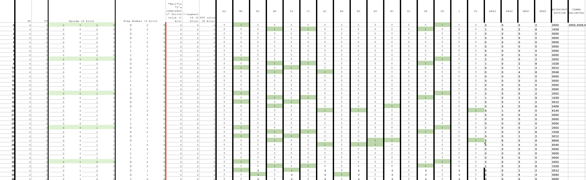
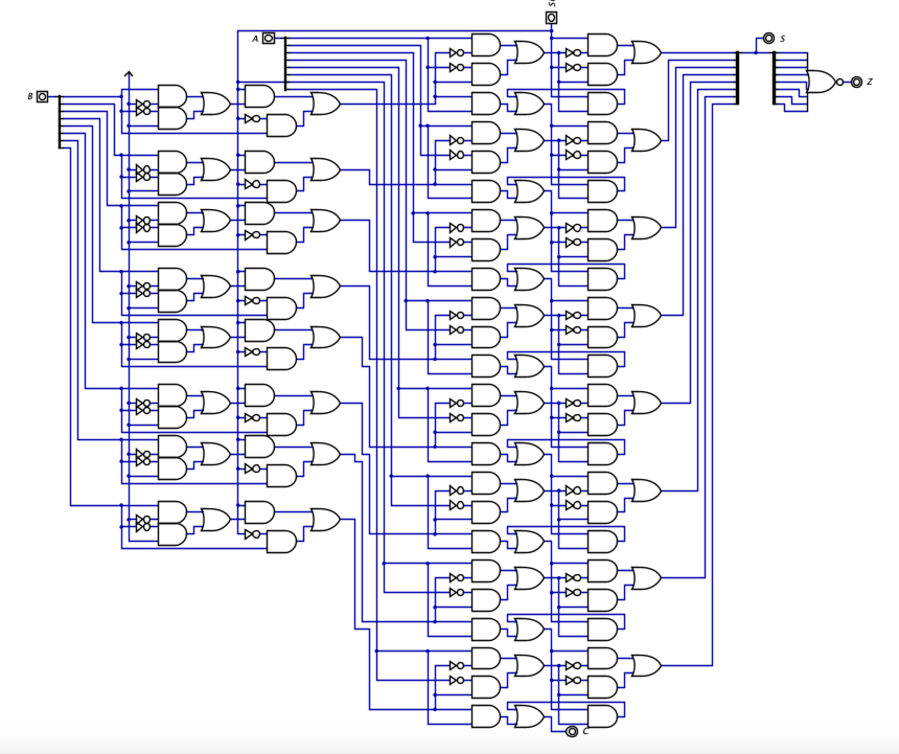
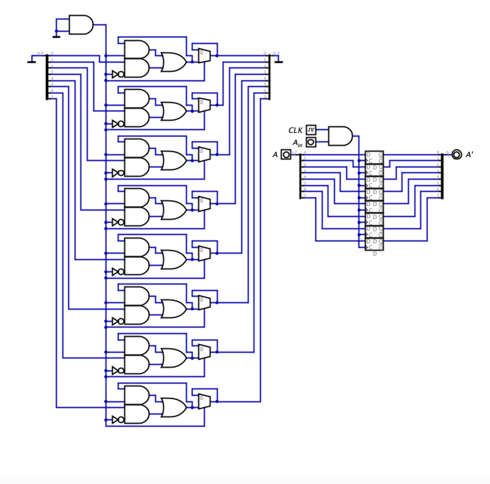

# SAP
A Simple-As-Possible computer design using digital logic

## Introduction to SAP ##

SAP is a 8-bit computer architecture designed by Ben Eater. Note that this project is not consistent with Ben Eaters design, as I did not use any tutuorial from his website to create it. This is simply a variant CPU that is based on the function of his design, created using knowledge of digital circuits.

A SAP computer has very few instructions due to its limited RAM capacity, but it can perform simple operations such as loading, adding, subtracting, and arithmetic-based jumping. The instruction list is as follows:

Programs using these 16 or fewer of these instructions combined with constant data can be manually loaded into the RAM module with the clock enabled to simulate the computer running it. 

## RAM Limitations

A large limitation of my particular design (which I am currently working to improve) is the RAM module, which is currently represented by a ROM module. This implies that the STA operation cannot be completed, though its corresponding microinstructions in the control unit are nonetheless correct for an implemented 4-bit RAM with 16 addresses and 8-bit block size. 

Currently, this is the program loaded into the ROM (limited RAM) module:

Which is a replicate of the following pseudocode: 

## Control Unit

The control unit of the SAP computer recieves a 9-bit input (flags from ALU, OPCODE from instruction register, and 5-bit counting circuit), which it decodes using a ROM module to a 16-bit output which controls the transfer of data between the other components. This is what the control circuit looks like:

And the inside of the ROM module implements the following dataset:

Which was uploaded directly to the Digital file using the following spreadsheet of microinstructions:

I encourage anyone who uses the computer or manipulates it in any way to understand some of the basic microinstructions. 

## ALU

The ALU used in my design is an 8-bit unsigned add/subtract circuit with a carryout bit (C) and a zero bit (Z). I am working on implementing some abstraction to use a carry-lookahead ALU design, but the implemented one functions as intended, if slightly inefficient. 

## Registers

Though I attempted to make every component using only the most basic digital logic units such as AND, OR, and NOT, the Digital software doesn't like stateful circuits with feedback sometimes, so I implemented each register using D flip flops. The Toggle Flip Flops are also made from D flip flops with an added Toggle circuit. 

