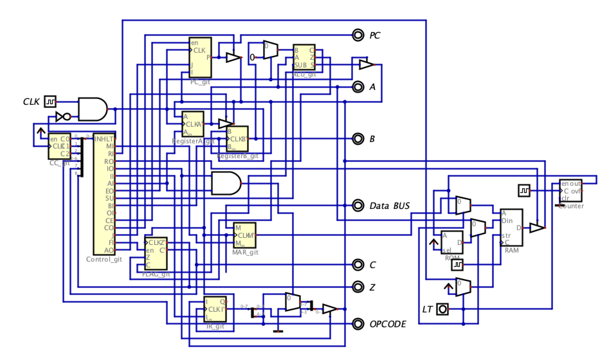
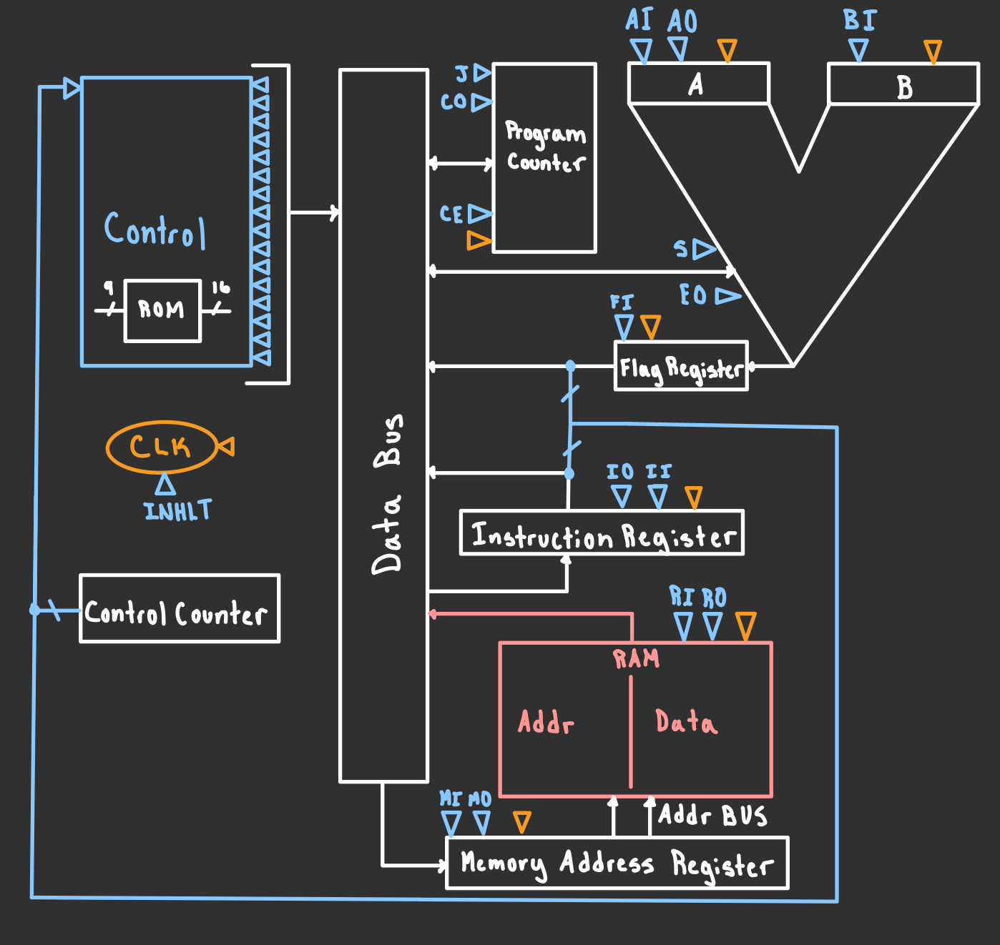
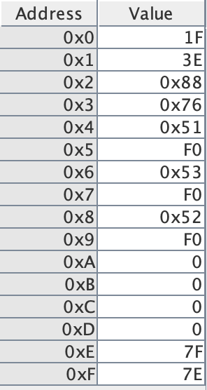

# SAP
A Simple-As-Possible 8-bit computer processor design using digital logic

## Introduction to SAP ##

SAP is an 8-bit computer architecture designed by Ben Eater. Note that this project is not consistent with Ben Eaters design, as I did not use any tutuorial from his website to create it. This is simply a variant CPU that is based on the function of his design, created using knowledge of digital circuits.

### Circuit:

### Schematic Diagram:

A SAP computer has very few instructions due to its limited RAM capacity, but it can perform simple operations such as loading, adding, subtracting, and arithmetic-based jumping. The instruction list is as follows:

Programs using these 16 or fewer of these instructions combined with constant data can be manually loaded into the RAM module with the clock enabled to simulate the computer running it. 

## Components

### Control Unit

The control unit is the brain of the SAP computer. It recieves a 9-bit input (flags from ALU, OPCODE from instruction register, and 5-bit counting circuit), which it decodes using a ROM module to a 16-bit output which administrates the transfer of data between the other components. Since all data is transfered through the data BUS, it essentially decides which components can read or write to and from the BUS. This is what the control circuit looks like:

And the inside of the ROM module implements the following dataset:

Which was uploaded directly to the .dig file using the comma delimited column in the following spreadsheet of microinstructions:

I encourage anyone who uses the computer or manipulates it in any way to understand some of the basic microinstructions, as they are the most personalizable aspect of the computer. Although you may load different programs into RAM, the microinstructions are what decide the processor's computing capabilities and the instruction set available. 

### RAM

The RAM module is has 4 address bits and and 8 data bits. At load time, you must manually load your program instructions from the ROM module into main memory via the LT input. Before running, enter your program into the associated 128-bit ROM module, starting at address 0. When you begin the simulation, simply activate the LT input and wait for the 4-bit counting circuit to load each individual instruction into RAM. This should only take a second or two, and it is essential that the clock attached to the RAM runs two cycles for each one cycle of the clock attached to the counter.

When it is not load time, the RAM will accept a 4-bit address input from the memory address register and an 8-bit data input from register A. It can write to the BUS when the RO control bit is high and store the data in A when the RI control bit is high.

Currently, this is the program loaded into the ROM (limited RAM) module:

Which is a replicate of the following pseudocode: 

## ALU

The ALU used in my design is an 8-bit add/subtract circuit with a carryout bit (C) and a zero bit (Z). Instead of using the Adder and Subtract components in digital, I used AND, OR, and NOT gates to make addition circuits and to negate B if the Sub bit is true. The carryout bit and zero bit, if loaded into the FLAGS register, are also input for the control unit that can decide jump instructions. 

I am working on implementing some abstraction to use a carry-lookahead ALU design, but the implemented one functions as intended, if slightly inefficient. 

## Registers

### Accumulator (Register A) and Register B

Register A acts as an accumulator register in this computer design, and register B acts as an intermediate register. Both can store 8 bits of data and can read data from the BUS. Register A, however, is the only one that can write data to the BUS (although it doesn't need to to communicate with the ALU), whereas register B's output is input directly to the ALU. 

### Memory Address Register

The Memory Address Register stores 4 bits and contains addresses that correspond to memory in RAM. It can read from the bus when the MI control bit is high, and its output is input directly to RAM.

### Flags Register

The Flags register stores the value of the C and Z bits after the previous arithmetic operation. Only after ADD and SUB instructions will the FI control bit be set to high, allowing the register to store the flags from the ALU. 

Though I attempted to make every component using only the most basic digital logic units such as AND, OR, and NOT, the Digital software doesn't like stateful circuits with feedback sometimes, so I implemented each register using D flip flops. The Toggle Flip Flops are also made from D flip flops with an added Toggle circuit. 

## Program Counter

The Program Counter mostly communicates with the Memory Address Register to sequentially work through the instructions in RAM. It is a 4-bit counting circuit implemented using toggle flip flop circuits. When the J control bit is high, it will read data from the BUS instead of continuing its count, and when the CE control bit is high, it will increase its count by 1. When the CO control bit is high, the Program Counter will write its value to the BUS. 
